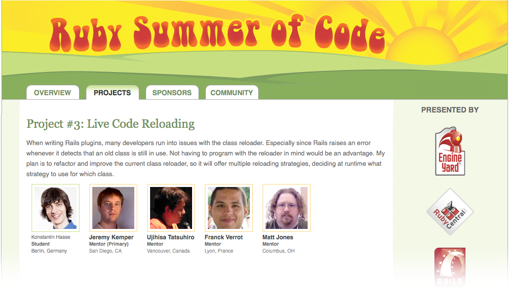

!SLIDE 
# Live Code Reloading #

!SLIDE bullets incremental
# Me #

* [rkh.im](http://rkh.im/), [github/rkh](http://github.com/rkh), [@konstantinhaase](http://twitter.com/konstantinhaase)
* Ruby dev at [Finnlabs](http://finn.de)
* Rubinius, Sinatra, Rack, ... Rails?

!SLIDE

!SLIDE bullets incremental
# ActiveSupport::Dependencies #

* `Expected some_module.rb to define SomeModule!`
* `A copy of SomeModule has been removed from the module tree but is still active!`
* `SomeModule is not missing constant SomeConstant!`