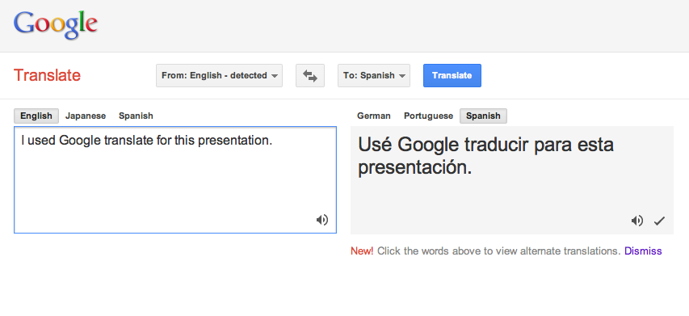
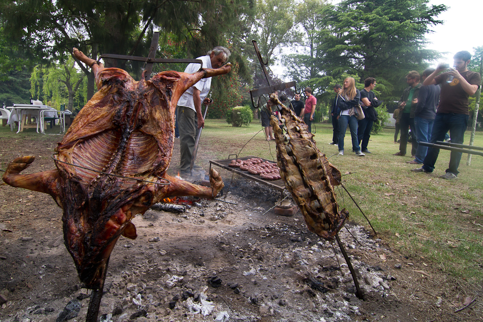

!SLIDE

## La verdadera pregunta es ...

.notes The real question is... --- Next: soccer

!SLIDE

## ¿Quién es el mejor fútbolista?

.notes Who is the best soccer player? --- Next: why

!SLIDE bullets incremental

* Ampliar tus horizonte.
* No deje Ruby ...
* ... evolucionar!

.notes * Broaden your horizon.
* Don't leave Ruby...
* ...evolve it! --- next: explore

!SLIDE center

## ¡Explora!

.notes * explore  --- next: google translate

!SLIDE center

## Por cierto ...

.notes Next: yuno en

!SLIDE center

.notes Next: yuno es

!SLIDE center

.notes Next: yuno jp

!SLIDE center

.notes Next: asado (Let's get started)

!SLIDE center
## Vamos a empezar!

.notes Let's get started! --- Next: tell something new

!SLIDE bullets incremental
## Goal: Tell you something new!
* no erlang, no go, no clojure
* no node.js

.notes Next: 100% OOP