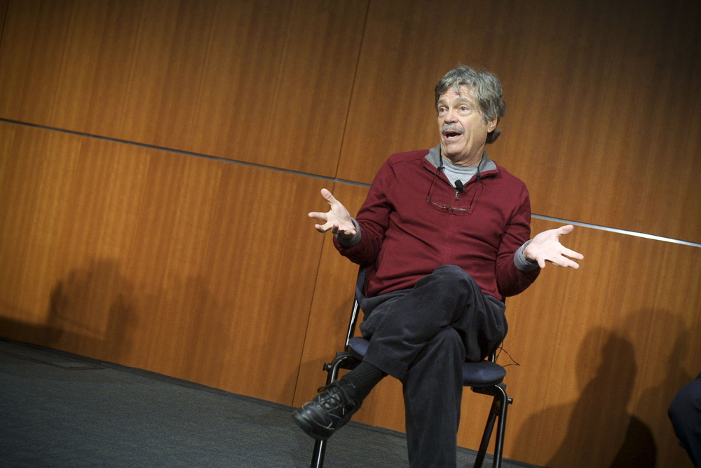
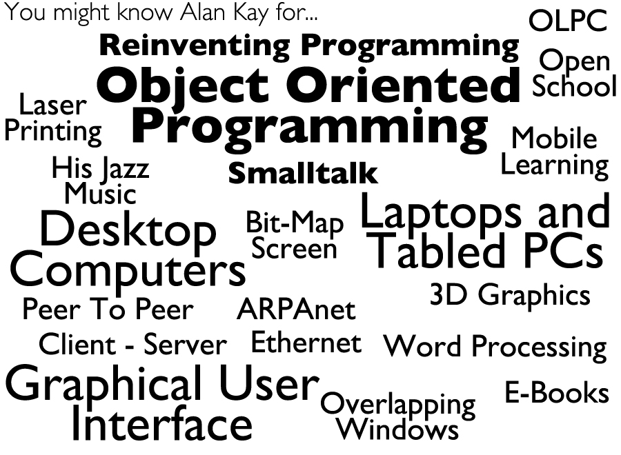

!SLIDE center

!SLIDE center

!SLIDE center
# Why implement Smalltalk on Rubinius? #

!SLIDE center
# Why create a programming language? #

!SLIDE center
# Why create? #

!SLIDE bullets

* "When you don't create things, you become defined by your tastes rather than
  ability. Your tastes only narrow and exclude people. So create."

* *why the lucky stiff*

!SLIDE center
# Why a programming language? #

!SLIDE bullets

* About programming languages:

* "I don’t like any of them, and I don’t think any
  of them are suitable for the real programming problems of today, whether for
  systems or for end-users"

* *Alan Kay*

!SLIDE bullets
# Problem Oriented Programming Languages #

* Cairo (~120k SLOC in C) rewritten in less than 400 lines

!SLIDE center
# Why Smalltalk? #

!SLIDE center
# Why Rubinius? #
