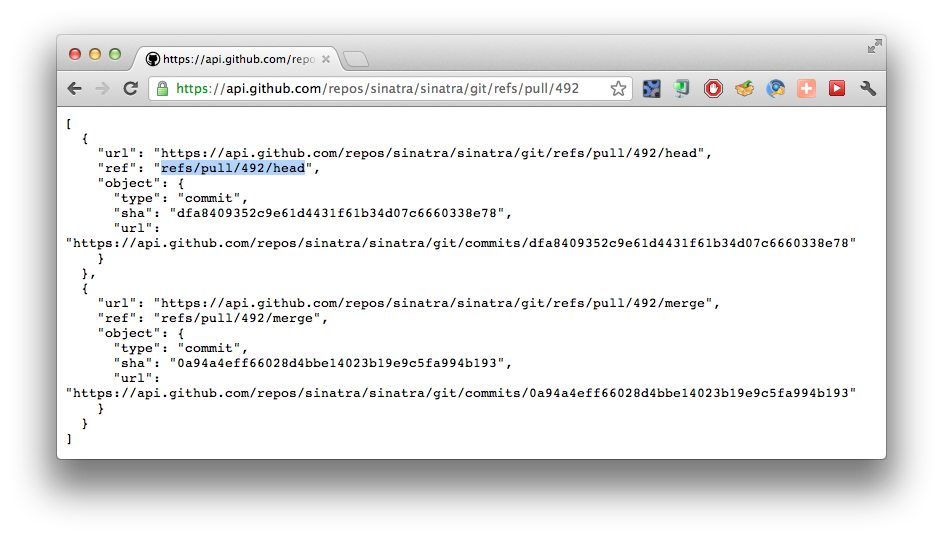

!SLIDE bullets

# Pull Requests #

* A Colaborators Dream Come True

!SLIDE center

!SLIDE center

!SLIDE center

!SLIDE center

!SLIDE center

!SLIDE center

!SLIDE center

!SLIDE center

!SLIDE bullets

# Announcement #

!SLIDE bullets

# We are going to fix this! #

!SLIDE bullets

# We have fixed it! #

!SLIDE bullets

# We start the rollout today #

* will enable it on per project basis
* big and huge donors get priority

!SLIDE center

!SLIDE center

!SLIDE center

!SLIDE center

!SLIDE center

!SLIDE center

!SLIDE center

!SLIDE center

!SLIDE center

!SLIDE center

!SLIDE code

    git fetch origin +refs/pull/492/merge:
    git checkout FETCH_HEAD

!SLIDE center

!SLIDE center

!SLIDE center

!SLIDE center

# Yet Another Github Library!?

!SLIDE center

!SLIDE center

!SLIDE code

    @@@ ruby
    gh = GH::DefaultStack.new
    gh['users/rkh']['name']

!SLIDE code

    @@@ ruby
    GH['users/rkh']['name']

!SLIDE code

    @@@ ruby
    GH.with username: 'rkh', password: 'x' do
      GH['user']['name']
    end

!SLIDE code

    @@@ ruby
    hook = GH.load(payload)
    hook['pull_request']['merge_commit']

!SLIDE

# Hypermedia

!SLIDE

    @@@ javascript
    {
      "_links": {
        "self": {"href": "..."},
        "html": {"href": "..."},
        "something": {"href": "..."}
      }
    }

!SLIDE bullets

# GH::LinkFollower

* If field does not exist, but link with same name exists, load data from link
* Do it lazily

!SLIDE bullets

# GH::LazyLoader

* If field does not exist, fetch data from self link
* Do it lazily

!SLIDE center

# One More Thing

!SLIDE

    @@@ javascript

    {
      "action": "synchronize",
      "pull_request": {
        "base": { ... },
        "head": { ... }
      }
    }

!SLIDE bullets incremental

* triggered if head updated
* triggered if base updated

!SLIDE center

!SLIDE bullets

* don't rebuild on base updates

!SLIDE center

!SLIDE center