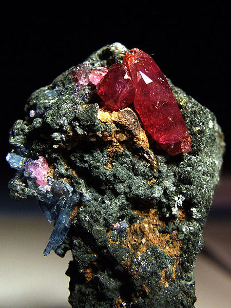
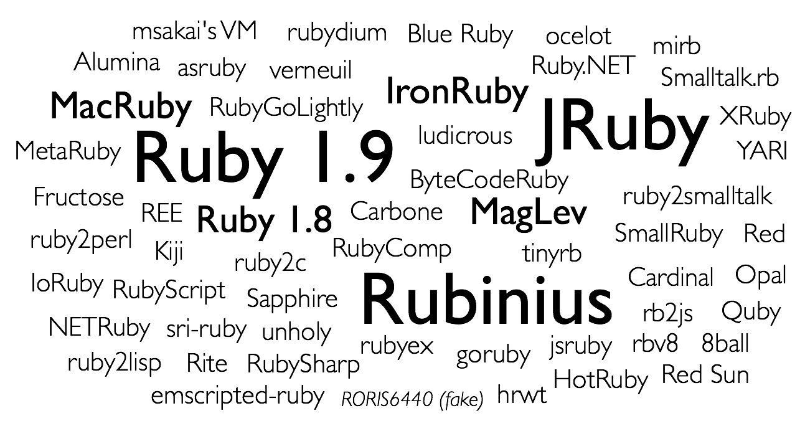

!SLIDE small

!SLIDE bullets incremental

* Ruby 1.8 is slow because it's interpreted.
* Surprise! Ruby 1.9 is interpreted, too.

!SLIDE bullets thanks
# Thanks!

* [github.com / rkh / presentations](https://github.com/rkh/presentations)

!SLIDE

# Ruby

!SLIDE

!SLIDE

!SLIDE small

!SLIDE bullets incremental

# What We'll Look Into

* **MRI**: method dispatch and execution
* **Rubinius**: inline caches and JIT
* **JRuby**: invokedynamic

!SLIDE

!SLIDE

!SLIDE

    @@@ ruby
    class DeepThought
      def ultimate_answer?(value)
        value.to_s == '42'
      end
    end

    DeepThought.new.ultimate_answer? 42

!SLIDE small left

# They Just Love Bytecode

## Ruby

    @@@ ruby
    value.to_s

## MRI

    @@@ ruby
    getlocal value
    send :to_s, 0, nil, 0, <ic:0>

## Rubinius

    @@@ ruby
    push_local 0
    send_stack :to_s, 0

## JRuby

    ALOAD 0
    LDC "to_s\uffffN\uffff\u0000\u0000\u0001\u0000\u0000\u0000\u0000\u0000\u0000...
    INVOKEVIRTUAL org/jruby/ast/executable/AbstractScript.initFromDescriptor (Lj...
    ...
    ALOAD 0
    INVOKEVIRTUAL ruby/__dash_e__.getCallSite0 ()Lorg/jruby/runtime/CallSite;
    ALOAD 1
    ALOAD 2
    ALOAD 9
    INVOKEVIRTUAL org/jruby/runtime/CallSite.call (Lorg/jruby/runtime/ThreadCont...

!SLIDE bullets incremental

# The Plan

* search for method
* execute method

!SLIDE

!SLIDE bullets incremental

# How To Speed That Up?

* search faster
* execute faster

!SLIDE bullets incremental

# Speed Up Search

* Inline Cache (aka Call/Send Site Cache)
* Lookup Cache
* Inlining

!SLIDE bullets incremental

# Speed Up Execution

* Reduce operations
* Just-in-time compilation
* Inlining
* Speed up search
