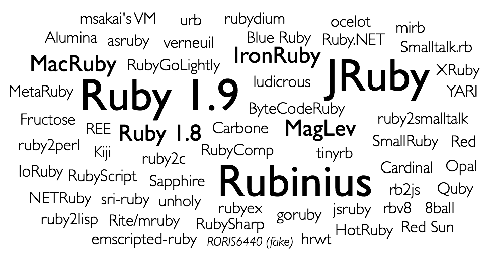

!SLIDE small

.notes Next up: 1.8/1.9 interpreted

!SLIDE bullets incremental

* Ruby 1.8 is slow because it's interpreted.
* Surprise! Ruby 1.9 is interpreted, too.

.notes 1.8, 1.9. Next up: Thanks!

!SLIDE bullets thanks
# Thanks!

* [github.com / rkh / presentations](https://github.com/rkh/presentations)

.notes Next up: Ruby

!SLIDE

# Ruby

.notes Next up: Bottle

!SLIDE

.notes Next up: Warning

!SLIDE

.notes Next up: Rubies

!SLIDE small

.notes Next up: What We'll Look Into

!SLIDE bullets incremental

# What We'll Look Into

* **MRI**: method dispatch and execution
* **Rubinius**: inline caches and JIT
* **JRuby**: invokedynamic

.notes MRI, RBX, JRuby. Next up: Thanks!

!SLIDE

.notes Next up: 42

!SLIDE

.notes Next up: DeepThought

!SLIDE

    @@@ ruby
    class DeepThought
      def ultimate_answer?(value)
        value.to_s == '42'
      end
    end

    DeepThought.new.ultimate_answer? 42

.notes Next up: They Just Love Bytecode

!SLIDE small left

# They Just Love Bytecode

## Ruby

    @@@ ruby
    value.to_s

## MRI

    @@@ ruby
    getlocal value
    send :to_s, 0, nil, 0, <ic:0>

## Rubinius

    @@@ ruby
    push_local 0
    send_stack :to_s, 0

## JRuby

    ALOAD 0
    LDC "to_s\uffffN\uffff\u0000\u0000\u0001\u0000\u0000\u0000\u0000\u0000\u0000...
    INVOKEVIRTUAL org/jruby/ast/executable/AbstractScript.initFromDescriptor (Lj...
    ...
    ALOAD 0
    INVOKEVIRTUAL ruby/__dash_e__.getCallSite0 ()Lorg/jruby/runtime/CallSite;
    ALOAD 1
    ALOAD 2
    ALOAD 9
    INVOKEVIRTUAL org/jruby/runtime/CallSite.call (Lorg/jruby/runtime/ThreadCont...

.notes Next up: The Plan (search execute)

!SLIDE bullets incremental

# The Plan

* search for method
* execute method

.notes search, execute. Next up: Speeeeed

!SLIDE

.notes Next up: How To Speed That Up?

!SLIDE bullets incremental

# How To Speed That Up?

* search faster
* execute faster

.notes search, execute. Next up: Speed Up Search

!SLIDE bullets incremental

# Speed Up Search

* Inline Cache (aka Call/Send Site Cache)
* Lookup Cache
* Inlining

.notes inline cache, lookup cache, inlining.
Next up: Speed Up Execution

!SLIDE bullets incremental

# Speed Up Execution

* Reduce operations
* Just-in-time compilation
* Inlining
* Speed up search

.notes superops, jit, inlining, search.
Next up: MRI
