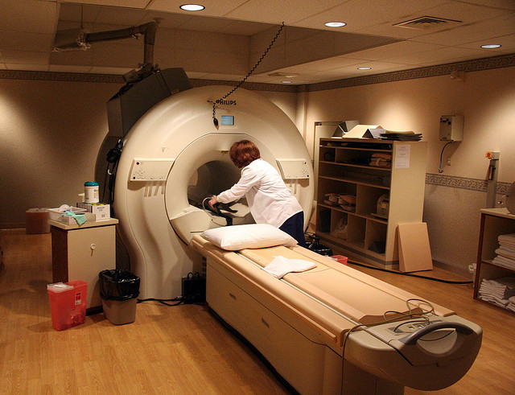
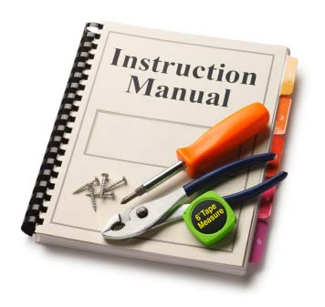

!SLIDE

# MRI

.notes Next Up: call

!SLIDE bullets

* a method gets called
* `rb_call0`

.notes Next Up: rb_call0

!SLIDE small

    @@@ c
    static inline VALUE
    rb_call0(VALUE recv, ID mid, int argc, const VALUE *argv,
             call_type scope, VALUE self)
    {
        rb_method_entry_t *me = rb_search_method_entry(recv, mid);
        rb_thread_t *th = GET_THREAD();
        int call_status = rb_method_call_status(th, me, scope, self); // <- SEARCH

        if (call_status != NOEX_OK) {
          return method_missing(recv, mid, argc, argv, call_status);
        }
        stack_check();
        return vm_call0(th, recv, mid, argc, argv, me);               // <- EXECUTE
    }

.notes Next Up: search

!SLIDE

.notes Next Up: search\_method

!SLIDE small

    @@@ c
    /*
     * rb_call0 searching for a method
     *  -> rb_method_entry
     *  -> rb_method_entry_get_without_cache
     *  -> search_method
     */
    static rb_method_entry_t*
    search_method(VALUE klass, ID id)
    {
        st_data_t body;
        if (!klass) {
          return 0;
        }

        while (!st_lookup(RCLASS_M_TBL(klass), id, &body)) {
          klass = RCLASS_SUPER(klass);
            if (!klass) {
              return 0;
            }
        }

        return (rb_method_entry_t *)body;
    }

.notes Next Up: run

!SLIDE

.notes Next Up: vm_call0

!SLIDE small

    @@@ c
    /*
     * rb_call0 executing a method
     * -> vm_call0
     */
    static inline VALUE
    vm_call0(rb_thread_t* th, VALUE recv, VALUE id, int argc, const VALUE *argv,
             const rb_method_entry_t *me)
    {
        const rb_method_definition_t *def = me->def;
        VALUE val;
        const rb_block_t *blockptr = 0;
        // ...

      again:
        switch (def->type) {
          case VM_METHOD_TYPE_ISEQ: {
            rb_control_frame_t *reg_cfp;
            // ...
            vm_setup_method(th, reg_cfp, recv, argc, blockptr, 0 /* flag */, me);
            val = vm_exec(th); // <- EXECUTE !!!
            break;
          }
          // ...
        }
      // ...
    }

.notes Next Up: vm_exec

!SLIDE small

    @@@ c
    static VALUE
    vm_exec(rb_thread_t *th)
    {
      // ... go see for yourself ...
    }

.notes Next Up: instruction

!SLIDE

.notes Next Up: DEFINE_INSN send

!SLIDE small

    @@@ c
    DEFINE_INSN
    send
    (ID op_id, rb_num_t op_argc, ISEQ blockiseq, rb_num_t op_flag, IC ic)
    (...)
    (VALUE val)
    // inc += - (int)(op_argc + ((op_flag & VM_CALL_ARGS_BLOCKARG_BIT) ? 1 : 0));
    {
        const rb_method_entry_t *me;
        VALUE recv, klass;
        rb_block_t *blockptr = 0;
        VALUE flag = op_flag;
        int num = caller_setup_args(th, GET_CFP(), flag, (int)op_argc,
                  (rb_iseq_t *)blockiseq, &blockptr);
        ID id = op_id;

        /* get receiver */
        recv = (flag & VM_CALL_FCALL_BIT) ? GET_SELF() : TOPN(num);
        klass = CLASS_OF(recv);
        me = vm_method_search(id, klass, ic);
        CALL_METHOD(num, blockptr, flag, id, me, recv);
    }

.notes Next Up: Rubinius
