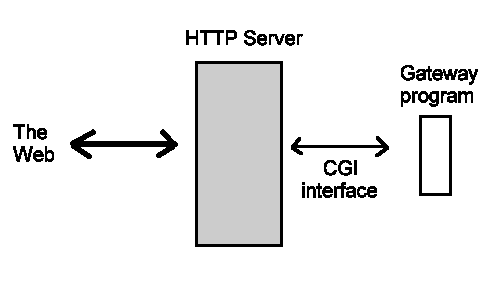
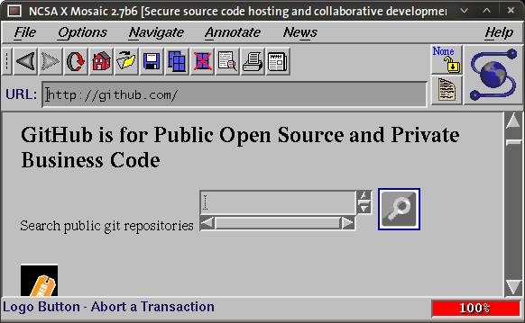

!SLIDE bullets incremental

# Let's pretend you don't know a thing...

* ... about Sinatra
* ... about Rails
* ... about Rack

!SLIDE

# The Past

## Or: "How We Do HTTP"

!SLIDE

## 1993
# CGI

!SLIDE

    @@@ perl
    #!/usr/bin/env perl
    print "Content-type: text/html\n";
    
    if ($ENV{"REQUEST_METHOD"} != "HEAD") {
      print "\n<h1>Hello Perl!</h1>\n"
    }

!SLIDE bullets incremental

* No structure (Hello, inline SQL!)
* Enormous performance overhead
* No asynchronous/streaming API
* Perl? Seriously?

!SLIDE

!SLIDE

## December 21, 1995
# Ruby 0.95

!SLIDE

    @@@ ruby
    #!/usr/bin/env ruby
    
    puts "Content-Type: text/html"
    
    if ENV["REQUEST_METHOD"] != "HEAD"
      puts "", "<h1>Hello Ruby!</h1>"
    end

!SLIDE

# Servlets

!SLIDE

    @@@ ruby
    require 'webrick'

    class Simple < WEBrick::HTTPServlet
      def do_GET(req, res)
        res.status = 200
        res['Content-Type'] = "text/html"
        res.body = "<h1>Hello Ruby!</h1>"
      end
    end

!SLIDE bullets incremental

* Not web server independent
* No asynchronous/streaming API
* Limited eco system

!SLIDE

## July 2004
# Ruby On Rails

!SLIDE bullets incremental

* Oh
* My
* God!

!SLIDE bullets incremental

* Convention Over Configuration
* Do Not Repeat Yourself
* Model - View - Controler
* Testing
* The eco system, oh my!

!SLIDE bullets incremental

* Did not play well with others
* Framework, not a library
* No asynchronous/streaming API

!SLIDE

## Summer 2005
# I discover Ruby! Woohoo!

!SLIDE

## December 13, 2005
# Rails 1.0

!SLIDE

## March 2007
# Rack 0.1

!SLIDE

    @@@ ruby
    proc do |env|
      [200, {"Content-Type" => "text/html"},
        ["<h1>Hello Ruby!</h1>"]]
    end

!SLIDE bullets incremental

* The simplest thing possible
* Zero dependency applications
* Great middleware/router infrastrucutre
* Server independent applications
* Easy testing

!SLIDE bullets incremental

* Near unusable directly
* Rails didn't use it
* No asynchronous/streaming API

!SLIDE

## September 9, 2007
# Sinatra 0.0.1

!SLIDE

    @@@ ruby
    get('/') { body "Hello World!" }
    post('/') { erb :posted }

!SLIDE bullets incremental

* Simple and clean DSL for writing Rack application.
* Library, not framework
* Plays well with anything Rack
* No hidden magic

!SLIDE bullets incremental

* Pollutes Object
* Uses `instance_eval` (slow)
* No asynchronous/streaming API
* One application per process

!SLIDE

## October 7, 2007
# Sinatra 0.1.0

!SLIDE

## October 8, 2007
# Sinatra 0.1.5

!SLIDE

    @@@ ruby
    before { puts "starting" }

    get('/') { "Hello World!" }
    delete('/') { haml :deleted }

    after { puts "done" }

!SLIDE

## November 21, 2007
# rm -Rf sinatra

!SLIDE

## April 12, 2008
# Sinatra 0.2.0
## (Complete Rewrite)

!SLIDE

    @@@ ruby
    before { halt 404 if path !~ /css/ }
    error(404) { "page not found" }
    
    get '/:name.css', :agent => /Firefox/ do
      sass :firefox
    end

!SLIDE

## April 14, 2008
# rm -Rf sinatra

!SLIDE

## September 8, 2008
# Sinatra 0.3.0

!SLIDE

    @@@ ruby
    use Rack::Lint
    configure { enable :lock }
    
    get('/*.css') { sass :style }

    __END__
    
    @@ style
    body
      color: red

!SLIDE

    @@@ ruby
    # config.ru
    use SomeMiddleware
    
    map('/a') { run Sinatra::Application }
    map('/b') { run Merb::Application }

!SLIDE

## December 13, 2008
# rm -Rf sinatra

!SLIDE

## January 18, 2009
# Sinatra 0.9.0

!SLIDE

    @@@ ruby
    class MyApp < Sinatra::Base
      get /js(on)?/, :provides => "json" do
        pass unless params[:pwd] == "foo"
        "Hello World".to_json
      end
      
      get "*" do
        "wrong password, probably"
      end
    end

!SLIDE bullets incremental

* No more `instance_eval` for routes
* More than one application per process

!SLIDE

## March 23, 2010
# Sinatra 1.0
## Major Refactorings since 0.9.0

!SLIDE bullets incremental

* Tilt has been extracted
* A ton of new helper methods
* Semantic Versioning

!SLIDE

## April - September 2010
# Maintainance crisis

!SLIDE

## October 24, 2010
# 1.1.0

!SLIDE

    @@@ ruby
    before agent: /Firefox/ do
      headers['X-Is-Firefox'] = "yes"
    end

    get('/') { markdown "# Hello World!" }

!SLIDE

## March 3, 2011
# 1.2.0
## Major Refactoring

!SLIDE bullets incremental

* Live release at Ruby Use Group Berlin
* Better extension API
* Better security
* Long term support

!SLIDE

## September 30, 2011
# 1.3.0

!SLIDE bullets incremental

* Live release at RubyConf in New Orleans
* Better HTTP compatibility
* Better security (rack-protection)
* Stream/asynchronous API, finally!

!SLIDE bullets incremental

    @@@ ruby
    get '/' do
      stream do |out|
        out << "It's gonna be legen -\n"
        sleep 0.5

        out << " (wait for it) \n"
        sleep 1

        out << "- dary!\n"
      end
    end

!SLIDE

    @@@ ruby
    connections = []

    get '/' do
      stream(:keep_open) do |out|
        connections << out
      end
    end

    post '/' do
      connections.each do |out|
        out << params[:message]
      end

      "message sent"
    end
    