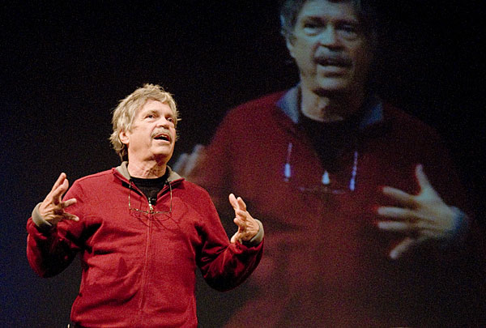

!SLIDE

# Full Object Orientation

.notes Next: Doesn't Ruby have that?

!SLIDE bullets

# Doesn't Ruby have that already?

.notes Next: OOP != OOP

!SLIDE bullets

# OOP != OOP

.notes Next: Simula

!SLIDE bullets

* "Objects are data and functionality."

* *Your high-school teacher*

.notes Next: Alan Kay

!SLIDE

.notes Next: Kay about C++

!SLIDE bullets

* "Actually I made up the term object-oriented, and I can tell you I did not
  have C++ in mind."

* *Alan Kay*

.notes Next: OOP Kay

!SLIDE bullets

* "OOP to me means only messaging,  local retention and protection and
  hiding  of state-process, and extreme late-binding  of all things."

* *Alan Kay*

.notes Next: messaging

!SLIDE bullets highlight

* "OOP to me means only **messaging**, local retention and protection and
  hiding of state-process, and extreme late-binding of all things."

* *Alan Kay*

.notes Next: if ruby

!SLIDE

    @@@ ruby
    if response == 42
      "correct!"
    else
      "wrong"
    end

.notes Next: if smalltalk

!SLIDE

    @@@ smalltalk
    response = 42
      ifTrue:  [ 'correct!' ]
      ifFalse: [ 'wrong' ]

.notes Next: if as method in ruby

!SLIDE

    @@@ ruby
    def true.if_true
      yield
    end

    def false.if_true
    end

.notes Next: no def

!SLIDE smallish

    @@@ ruby
    TrueClass.define_method(:if_true) { yield }

    FalseClass.define_method(:if_true) { }

.notes Next: duck type

!SLIDE

    @@@ ruby
    class Falsy
      def if_true; end
    end

.notes Next: duck type hash

!SLIDE

    @@@ ruby
    x = Delegator.new({})

    x.is_a? Hash # => true

    case x
    when Hash
      ...
    else
      fail
    end

.notes Next: no data structures

!SLIDE bullets

* Don't treat your objects like data structures!

.notes Next: example

!SLIDE smallish

    @@@ ruby
    my_instance.properties[:foo][1,4] == "blah"
    
    my_instance.foo? "blah"

.notes Next: kay OOP again

!SLIDE bullets

* "OOP to me means only messaging, local retention and protection and
  hiding of state-process, and extreme late-binding of all things."

* *Alan Kay*

.notes Next: late binding

!SLIDE bullets highlight

* "OOP to me means only messaging, local retention and protection and
  hiding of state-process, and **extreme late-binding** of all things."

* *Alan Kay*

.notes Next: ruby spec

!SLIDE bullets

* "A conforming processor may omit an invocation of a method of a built-in
  class or module for optimization purpose, and do the same calculation as the
  method instead.

* In this case, even if a program redefines the method, the behavior of the
  program might not change because the redefined method might not actually be
  invoked."

* *Ruby Standard (JIS X 3017)*

.notes Next: Whut

!SLIDE

.notes Next: keywords

!SLIDE bullets

* Every built-in Ruby method could actually be a keyword.

!SLIDE bullets

.notes Next: is smalltalk oop?

