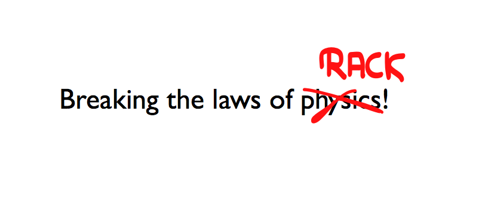
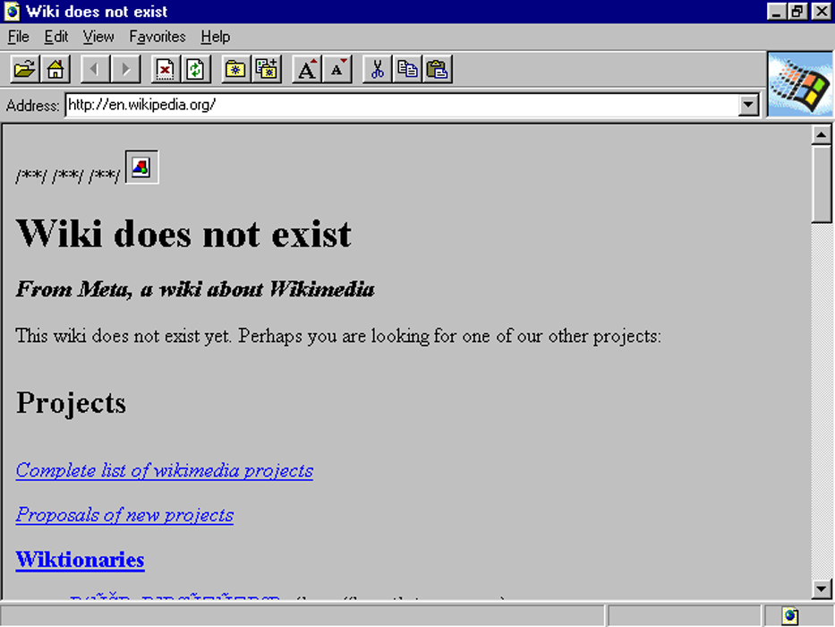
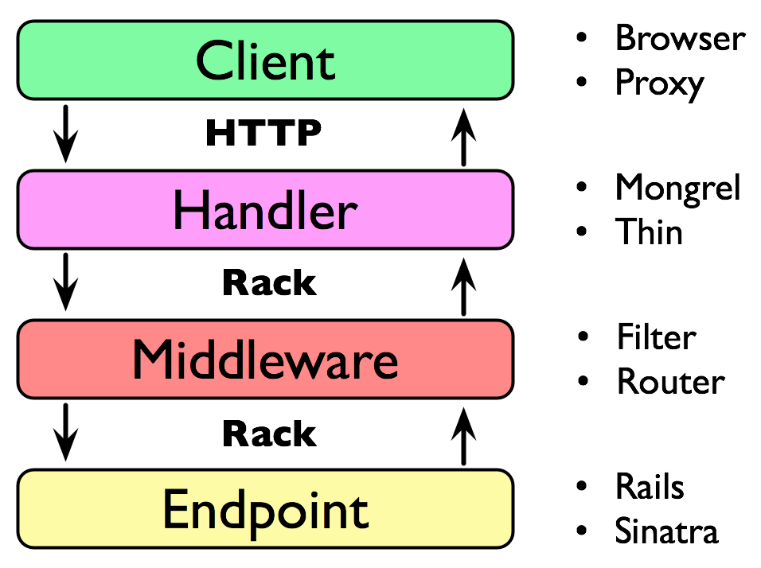
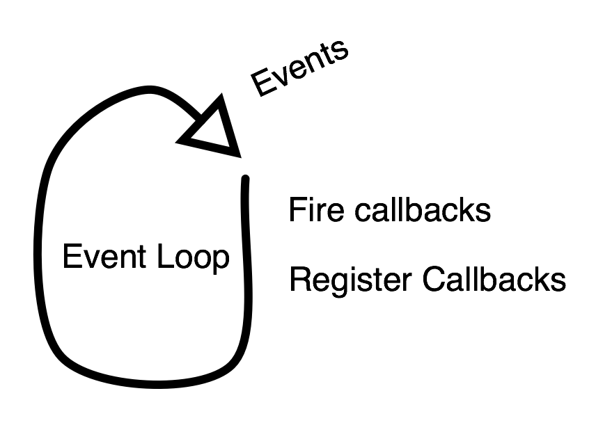

!SLIDE bullets

* 

.notes Next: good old web

!SLIDE center

.notes Next: ajax

!SLIDE center

.notes Next: Comet

!SLIDE center

.notes Next: Real Time

!SLIDE bullets

* 

.notes Next: come again?

!SLIDE bullets incremental

# Come again? #

* streaming
* server push

.notes streaming, server push. --- Next: decide what to send while streaming, not upfront

!SLIDE bullets

* decide what to send while streaming, not upfront

.notes Next: usage example

!SLIDE bullets

* Streaming APIs
* Server-Sent Events
* Websockets

.notes Next: demo

!SLIDE center

# Demo! #

<iframe src="/events?" width="980" height="600"></iframe>

.notes Next: Rack

!SLIDE bullets incremental

# Rack #

* Ruby to HTTP to Ruby bridge
* Middleware API
* Powers Rails, Sinatra, Ramaze, ...

.notes HTTP bridge, middleware, frameworks. --- Next: rack stack

!SLIDE center

.notes Next: simple rack app

!SLIDE smallish

    @@@ ruby
    welcome_app = proc do |env|
      [200, {'Content-Type' => 'text/html'},
        ['Welcome!']]
    end

.notes Next: with any object

!SLIDE smallish

    @@@ ruby
    welcome_app = Object.new

    def welcome_app.call(env)
      [200, {'Content-Type' => 'text/html'},
        ['Welcome!']]
    end

.notes Next: in sinatra

!SLIDE

    @@@ ruby
    get('/') { 'Welcome!' }

.notes Next: pseudo handler

!SLIDE smallish

    @@@ ruby
    env = parse_http

    status, headers, body =
      welcome_app.call env

    io.puts "HTTP/1.1 #{status}"
    headers.each { |k,v| io.puts "#{k}: #{v}" }
    io.puts ""

    body.each { |str| io.puts str }

    close_connection

.notes Next: middleware

!SLIDE smallish

# Middleware #

.notes Next: upcase example

!SLIDE smallish

    @@@ ruby
    # foo => FOO
    class UpperCase
      def initialize(app)
        @app = app
      end

      def call(env)
        status, headers, body = @app.call(env)
        upper = []
        body.each { |s| upper << s.upcase }
        [status, headers, upper]
      end
    end

.notes Next: config.ru

!SLIDE large

    @@@ ruby
    # set up middleware
    use UpperCase

    # set endpoint
    run welcome_app

.notes Next: call app (from before)

!SLIDE

    @@@ ruby
    status, headers, body =
      welcome_app.call(env)

.notes Next: wrap in middleware

!SLIDE smallish

    @@@ ruby
    app = UpperCase.new(welcome_app)

    status, headers, body = app.call(env)

.notes Next: streaming with each

!SLIDE
# Streaming with #each #

.notes Next: custom body object

!SLIDE smallish

    @@@ ruby
    my_body = Object.new
    get('/') { my_body }

    def my_body.each
      20.times do
        yield "
%s
" % Time.now
        sleep 1
      end
    end

.notes Next: Let's build a messaging service!

!SLIDE bullets

* Let's build a messaging service!

.notes Next: sinatra app

!SLIDE smallish

    @@@ ruby
    subscribers = []

    get '/' do
      body = Subscriber.new
      subscribers << body
      body
    end

    post '/' do
      subscribers.each do |s|
        s.send params[:message]
      end
    end

.notes Next: subscriber object

!SLIDE smallish

    @@@ ruby
    class Subscriber
      def send(data)
        @data = data
        @thread.wakeup
      end

      def each
        @thread = Thread.current
        loop do
          yield @data.to_s
          sleep
        end
      end
    end

.notes Next: issues with this

!SLIDE bullets incremental

* blocks the current thread
* does not work well with some middleware
* does not work (well) on evented servers   (Thin, Goliath, Ebb, Rainbows!)

.notes blocks, middleware, evented servers. --- Next: evented streaming

!SLIDE

# Evented streaming with async.callback #

.notes Next: event loop graphics

!SLIDE center

.notes Next: webscale

!SLIDE center

.notes Next: without eventloop

!SLIDE

    @@@ ruby
    sleep 10
    puts "10 seconds are over"
    
    puts Redis.new.get('foo')

.notes Next: with eventloop

!SLIDE smallish

    @@@ ruby
    require 'eventmachine'

    EM.run do
      EM.add_timer 10 do
        puts "10 seconds are over"
      end

      redis = EM::Hiredis.connect
      redis.get('foo').callback do |value|
        puts value
      end
    end

.notes Next: async.callback

!SLIDE smallish

    @@@ ruby
    get '/' do
      EM.add_timer(10) do
        env['async.callback'].call [200,
          {'Content-Type' => 'text/html'},
          ['sorry you had to wait']]
      end

      "dear server, I don't have a  " \
      "response yet, please wait 10 " \
      "seconds, thank you!"
    end

.notes Next: throw

!SLIDE smallish

# With #throw #

    @@@ ruby
    get '/' do
      EM.add_timer(10) do
        env['async.callback'].call [200,
          {'Content-Type' => 'text/html'},
          ['sorry you had to wait']]
      end

      # will skip right to the handler
      throw :async
    end

.notes Next: -1

!SLIDE smallish

# Status Code #

    @@@ ruby
    get '/' do
      EM.add_timer(10) do
        env['async.callback'].call [200,
          {'Content-Type' => 'text/html'},
          ['sorry you had to wait']]
      end

      # will go through middleware
      [-1, {}, []]
    end

.notes Next: async-sinatra

!SLIDE smallish

    @@@ ruby
    # gem install async-sinatra
    require 'sinatra/async'

    aget '/' do
      EM.add_timer(10) do
        body 'sorry you had to wait'
      end
    end

.notes Next: with redis

!SLIDE smallish

    @@@ ruby
    redis = EM::Hiredis.connect

    aget '/' do
      redis.get('foo').callback do |value|
        body value
      end
    end

.notes Next: pseudo handler with callback

!SLIDE smallish

    @@@ ruby
    env = parse_http

    cb = proc do |response|
      send_headers(response)
      response.last.each { |s| send_data(s) }
      close_connection
    end

    catch(:async) do
      env['async.callback'] = cb
      response = app.call(env)
      cb.call(response) unless response[0] == -1
    end

.notes Next: postponing, not streaming

!SLIDE bullets incremental

* that's postponing ...
* ... not streaming

.notes Next: EM::Deferrable

!SLIDE

# EM::Deferrable #

.notes Next: Deferrable explained

!SLIDE smallish

    @@@ ruby
    require 'eventmachine'

    class Foo
      include EM::Deferrable
    end

    EM.run do
      f = Foo.new
      f.callback { puts "success!" }
      f.errback { puts "something went wrong" }
      f.succeed
    end

.notes Next: pseudo handler - callback from before

!SLIDE smallish

    @@@ ruby
    cb = proc do |response|
      send_headers(response)
      response.last.each { |s| send_data(s) }
      close_connection
    end

.notes Next: pseudo handler - new callback

!SLIDE smallish

    @@@ ruby
    cb = proc do |response|
      send_headers(response)
      body = response.last
      body.each { |s| send_data(s) }

      if body.respond_to? :callback
        body.callback { close_connection }
        body.errback { close_connection }
      else
        close_connect
      end
    end

.notes Next: Evented Messaging System

!SLIDE

# Evented Messaging System #

.notes Next: old messaging system

!SLIDE smallish

    @@@ ruby
    # THIS IS NOT EVENTED

    subscribers = []

    get '/' do
      body = Subscriber.new
      subscribers << body
      body
    end

    post '/' do
      subscribers.each do |s|
        s.send params[:message]
      end
    end

.notes Next: new messaging system (sinatra app)

!SLIDE smallish

    @@@ ruby
    subscribers = []

    aget '/' do
      body Subscriber.new
      subscribers << body
    end

    post '/' do
      subscribers.each do |s|
        s.send params[:message]
      end
    end

.notes Next: new subscriber class

!SLIDE smallish

    @@@ ruby
    class Subscriber
      include EM::Deferrable

      def send(data)
        @body_callback.call(data)
      end

      def each(&blk)
        @body_callback = blk
      end
    end

.notes Next: callback again

!SLIDE smallish

    @@@ ruby
    cb = proc do |response|
      send_headers(response)
      body = response.last
      body.each { |s| send_data(s) }

      if body.respond_to? :callback
        body.callback { close_connection }
        body.errback { close_connection }
      else
        close_connect
      end
    end

.notes Next: new subscriber class (again)

!SLIDE smallish

    @@@ ruby
    class Subscriber
      include EM::Deferrable

      def send(data)
        @body_callback.call(data)
      end

      def each(&blk)
        @body_callback = blk
      end
    end

.notes Next: delete subscribers

!SLIDE smallish

    @@@ ruby
    delete '/' do
      subscribers.each do |s|
        s.send "Bye bye!"
        s.succeed
      end
      
      subscribers.clear
    end

.notes Next: Server-Sent Events

!SLIDE bullets

# Server-Sent Events #

* [dev.w3.org/html5/eventsource](http://dev.w3.org/html5/eventsource/)

.notes Next: explained

!SLIDE bullets incremental

* Think one-way WebSockets
* Simple
* Resumable
* Client can be implemented in JS
* Degrade gracefully to polling

.notes one-way WS, simple, resumable, client in JS, degrade --- Next: js code

!SLIDE smallish

    @@@ javascript
    var source = new EventSource('/updates');
    
    source.onmessage = function (event) {
      alert(event.data);
    };

.notes Next: HTTP headers

!SLIDE

    HTTP/1.1 200 OK
    Content-Type: text/event-stream

.notes Next: HTTP headers + 1

!SLIDE

    HTTP/1.1 200 OK
    Content-Type: text/event-stream

    data: This is the first message.

.notes Next: HTTP headers + 2

!SLIDE

    HTTP/1.1 200 OK
    Content-Type: text/event-stream

    data: This is the first message.

    data: This is the second message, it
    data: has two lines.

.notes Next: HTTP headers + 3

!SLIDE

    HTTP/1.1 200 OK
    Content-Type: text/event-stream

    data: This is the first message.

    data: This is the second message, it
    data: has two lines.

    data: This is the third message.

.notes Next: with IDs

!SLIDE

    HTTP/1.1 200 OK
    Content-Type: text/event-stream
    
    data: the client
    id: 1
    
    data: keeps track
    id: 2
    
    data: of the last id
    id: 3

.notes Next: EventSource in Ruby

!SLIDE smallish

    @@@ ruby
    class EventSource
      include EM::Deferrable

      def send(data, id = nil)
        data.each_line do |line|
          line = "data: #{line.strip}\n"
          @body_callback.call line
        end
        @body_callback.call "id: #{id}\n" if id
        @body_callback.call "\n"
      end

      def each(&blk)
        @body_callback = blk
      end
    end

.notes Next: WebSockets

!SLIDE bullets

# WebSockets #

* Think two-way EventSource

.notes Next: JS WebSockets

!SLIDE smallish

    @@@ javascript
    var src = new WebSocket('ws://127.0.0.1/');
    
    src.onmessage = function (event) {
      alert(event.data);
    };

.notes Next: JS EventSource

!SLIDE smallish

    @@@ javascript
    var src = new EventSource('/updates');

    src.onmessage = function (event) {
      alert(event.data);
    };

.notes Next: JS WebSocket

!SLIDE smallish

    @@@ javascript
    var src = new WebSocket('ws://127.0.0.1/');

    src.onmessage = function (event) {
      alert(event.data);
    };

.notes Next: JS WebSocket with send

!SLIDE smallish

    @@@ javascript
    var src = new WebSocket('ws://127.0.0.1/');

    src.onmessage = function (event) {
      alert(event.data);
    };

    src.send("ok, let's go");

.notes Next: Ruby WebSocket

!SLIDE smallish

    @@@ ruby
    options = { host: '127.0.0.1', port: 8080 }
    EM::WebSocket.start(options) do |ws|
      ws.onmessage { |msg| ws.send msg }
    end

.notes Next: WebSockets are hard to use

!SLIDE bullets incremental

# WebSockets are hard to use #

* Protocol upgrade (not vanilla HTTP)
* Specification in flux
* Client support incomplete
* Proxies/Load Balancers have issues
* Rack can't do it

.notes Protocol upgrade, in flux, client support, proxies, rack --- Next: sinatra streaming

!SLIDE bullets

# Sinatra Streaming API #

* introduced in Sinatra 1.3

.notes Next: example

!SLIDE smallish

    @@@ ruby
    get '/' do
      stream do |out|
        out << "It's gonna be legen -\n"
        sleep 0.5
        out << " (wait for it) \n"
        sleep 1
        out << "- dary!\n"
      end
    end

.notes Next: keep open

!SLIDE smallish

    @@@ ruby
    connections = []

    get '/' do
      # keep stream open
      stream(:keep_open) do |out|
        connections << out
      end
    end

    post '/' do
      # write to all open streams
      connections.each do |out|
        out << params[:message] << "\n"
      end
      "message sent"
    end

.notes Next: done
