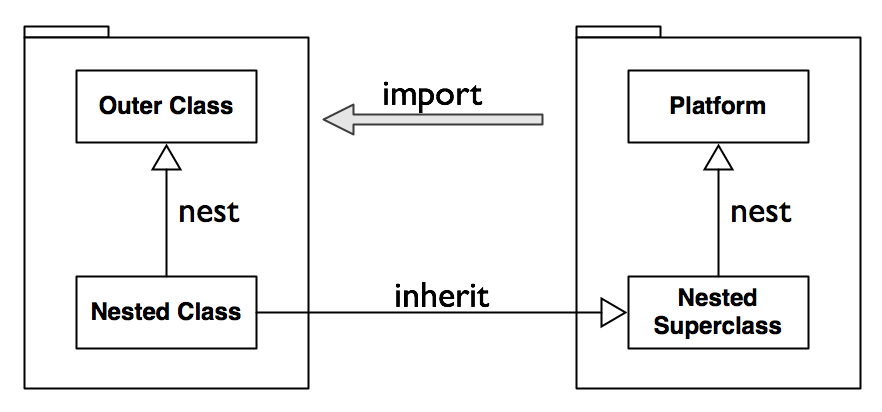
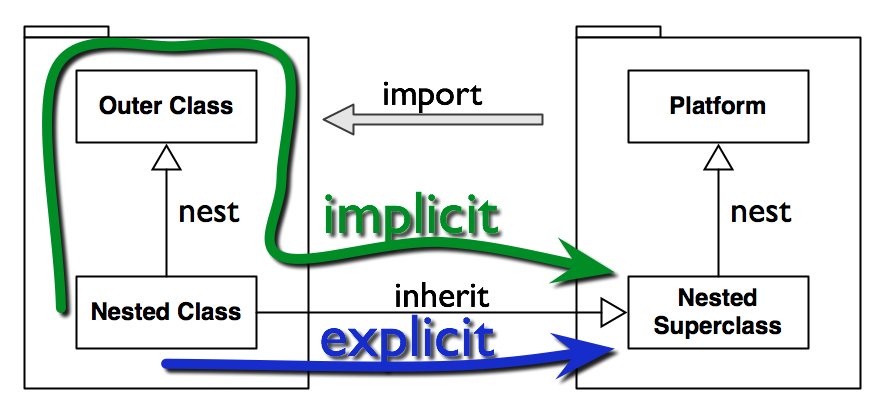

!SLIDE

# Is Smalltalk Object Oriented?

.notes Next: all method sends

!SLIDE bullets incremental

* variable/constant access is no method send

* `self`/`super` is no method send

.notes Next: implementation issues

!SLIDE bullets incremental

# Also...

* no implementation treats `ifTrue` sends to a boolean as method send

* constants are not late bound

.notes Next: newspeak

!SLIDE bullets incremental

# Newspeak

* there are only method sends

* there is no global state

.notes Next: lexical scope

!SLIDE

## But I want lexical scope!

.notes Next: nesting example

!SLIDE

    @@@ ruby
    Foo = 42

    class Bar
      def foo(x) Foo + x end
    end

.notes Next: complex nesting example

!SLIDE

    @@@ ruby
    Outer = 23

    module Wrapper
      Inner = 42

      class Nested
        def result
          Outer + Inner
        end
      end
    end

.notes Next: solution

!SLIDE

## Solution: clever, bidirectional dispatch

.notes Next: nesting

!SLIDE

.notes Next: dispatch

!SLIDE

.notes Next: homoiconic
