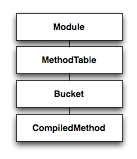

!SLIDE

# Rubinius

[ image ]

!SLIDE

!SLIDE smallish

    @@@ ruby
    klass  = object.singleton_class
    method = nil

    while klass and not method
      method = klass.method_table.lookup(:some_method)
      klass  = klass.direct_superclass
    end

!SLIDE ruby commandline incremental

    >> cm = DeepThought.method_table \
    ?>        .lookup(:ultimate_answer?).method
    => #<Rubinius::CompiledMethod ultimate_answer?>
    
    >> puts cm.decode
    0000:  push_local                 0    # value
    0002:  send_stack                 :to_s, 0
    0005:  push_literal               "42"
    0007:  string_dup                 
    0008:  meta_send_op_equal         :==
    0010:  ret                        
    => nil
    
    >> cm.iseq.opcodes
    => #<Rubinius::Tuple: 20, 0, 49, 0, 0, 7, 1, 64, 83, 2, 11>
    
    >> cm.literals
    => #<Rubinius::Tuple: :to_s, "42", :==>

.notes compiled method, decode, opcodes, literals

!SLIDE smallish

    @@@ ruby
    literals: :to_s, "42", :==   locals: value (42)
    bytes: 20 0 49 0 0 7 1 64 83 2 11

    bytes     decoded               stack
    20 0      push_local 0          [ 42         ]
    49 0 0    send_stack :to_s, 0   [ "42"       ]
    7  1      push_literal "42"     [ "42", "42" ]
    64        string_dup            [ "42", "42" ]
    83 2      meta_send_op_equal    [ true       ]
    11        ret                   [            ]
