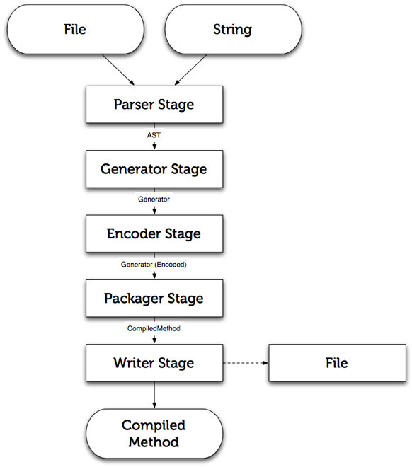

!SLIDE bullets

# Reak #

* [github.com/rkh/Reak](https://github.com/rkh/Reak)
* Like Squeak but with R

!SLIDE center

!SLIDE bullets

# The Rubinius Compiler #

* Pure Ruby
* Modular and Flexible
* [`lib/compiler`](https://github.com/rubinius/rubinius/tree/master/lib/compiler)

!SLIDE center

!SLIDE bullets

# Parsing with KPeg #

* [github.com/evanphx/kpeg](https://github.com/evanphx/kpeg)

!SLIDE spaced

    @@@ smalltalk
    " from Reak.AST.Self "
    grammar: g [ ^ g str: 'self' ]

&nbsp;

    @@@ ruby
    # from Reak::AST::Return
    def bootstrap_grammar(g)
      g.seq "^", :sp, g.t(:expression)
    end

!SLIDE center

# Rubinius Bytecode #

!SLIDE

<pre>
$ rbx compile -B -e 'puts "Hello World"'

0000:  push_self
0001:  push_literal     "Hello World"                
0003:  allow_private              
0004:  send_stack       :puts, 1
</pre>

!SLIDE

<pre>
$ rbx compile -B -e 'puts "Hello World"'

<b>0000:  push_self</b>
0001:  push_literal     "Hello World"                
0003:  allow_private              
0004:  send_stack       :puts, 1
</pre>

!SLIDE

<pre>
$ rbx compile -B -e 'puts "Hello World"'

0000:  push_self
<b>0001:  push_literal     "Hello World"</b>
0003:  allow_private              
0004:  send_stack       :puts, 1
</pre>

!SLIDE

<pre>
$ rbx compile -B -e 'puts "Hello World"'

0000:  push_self
0001:  push_literal     "Hello World"                
<b>0003:  allow_private</b>
0004:  send_stack       :puts, 1
</pre>

!SLIDE

<pre>
$ rbx compile -B -e 'puts "Hello World"'

0000:  push_self
0001:  push_literal     "Hello World"                
0003:  allow_private              
<b>0004:  send_stack       :puts, 1</b>
</pre>

!SLIDE

    @@@ ruby
    class Object
      dynamic_method(:display) do |g|
        g.push_self
        g.push_local(0) # first argument
        g.send(:puts, 1, true)
        g.ret
      end
    end

    display "Hello World"

!SLIDE center

# Reusing the Rubinius tool chain #

!SLIDE center

!SLIDE

    @@@ ruby
    class Reak::Compiler < Rubinius::Compiler
      class Parser < Stage
        stage :parser
        next_stage Generator
      end
    end

!SLIDE

    @@@ ruby
    class CustomNode < Reak::AST::Base
      def self.bootstrap_grammar(g)
        # grammar definition
      end

      def bytecode(g)
        # bytecode definition
      end
    end

!SLIDE smallish

    @@@ ruby
    class ConstantAccess < Rubinius::AST::ConstantAccess
      include Reak::AST::Node
      Reak::AST::Primary.push self

      def self.bootstrap_grammar(g)
        g.t /[A-Z][a-zA-Z0-9_]*/
      end

      # no bytecode definition necessary
    end

!SLIDE smallish

    @@@ smalltalk
    Rubinius.AST.TrueLiteral subclass: #TrueLiteral [
      Reak.AST.Primary push: self.
      self include: Reak.AST.Node.

      self class >> grammar: g [
        ^ g str: 'true'
      ].
    ]

!SLIDE

    @@@ smalltalk
    " Remember cascades? "

    g
      pushSelf;
      pushLocal: 0;
      send: #puts args: 1 private: true;
      ret.

!SLIDE smallish

    @@@ smalltalk
    Reak.AST.Base subclass: #Cascade [
      Reak.AST.Expression push: self.
      
      bytecode: g [
        g pushSelf.
        cascadedSends do:
          [:send |
          g dup.
          send bytecode: g.
          g pop ].
        lastSend bytecode: g.
      ]
    ]
