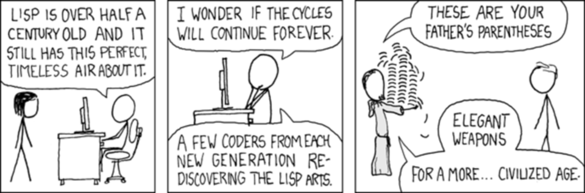

!SLIDE bullets
# Homoiconic #

.notes Next: wikipedia

!SLIDE bullets smallish

* "In computer programming, homoiconicity is a property of some programming
  languages, in which the primary representation of programs is also a data
  structure in a primitive type of the language itself, from the Greek words
  homo meaning the same and icon meaning representation. This makes
  metaprogramming easier than in a language without this property."

* Wikipedia

.notes Next: primary representation

!SLIDE bullets smallish highlight

* "In computer programming, homoiconicity is a property of some programming
  languages, in which<strong> the primary representation of programs </strong>is also a
  data structure in a primitive type of the language itself, from the Greek
  words homo meaning the same and icon meaning representation. This makes
  metaprogramming easier than in a language without this property."

* Wikipedia

.notes Next: data type

!SLIDE bullets smallish highlight

* "In computer programming, homoiconicity is a property of some programming
  languages, in which the primary representation of programs<strong> is also a data
  structure in a primitive type </strong>of the language itself, from the Greek words
  homo meaning the same and icon meaning representation. This makes
  metaprogramming easier than in a language without this property."

* Wikipedia

.notes Next: metaprogramming

!SLIDE bullets smallish highlight

* "In computer programming, homoiconicity is a property of some programming
  languages, in which the primary representation of programs is also a data
  structure in a primitive type of the language itself, from the Greek words
  homo meaning the same and icon meaning representation.<strong> This makes
  metaprogramming easier </strong>than in a language without this property."

* Wikipedia

.notes Next: languages

!SLIDE bullets

# Homoiconic Languages #

* Lisp, Logix, Prolog, Snobol, Io, Ioke, Lego

.notes Next: lisp

!SLIDE center bigimg

# LISP #

.notes Next: lists

!SLIDE large

    @@@ lisp
    '(1 2 3)

.notes Next: progs as lists

!SLIDE large

    @@@ lisp
    (+ 1 2) ; 3

.notes Next: setf

!SLIDE large

    @@@ lisp
    (setf b 23)

.notes Next: car & cdr

!SLIDE

    @@@ list
    (car '(1 2))          ; 1

    (cdr '(1 2))          ; '(2)

    (car (cdr '(1 2)))    ; 2

.notes Contents of the Address part of Register number, Contents of the Decrement part of Register number --- Next: eval

!SLIDE large

    @@@ lisp
    (setf a
        '(setf b 23))

    (eval a)

.notes Next: homoiconic example

!SLIDE

    @@@
    (setf a
      '(setf b 23))

    (setf
      (car
        (cdr (cdr a)))
      42)

    (eval a)

.notes Next: lisp king

!SLIDE center

.notes Next: useful?

!SLIDE bullets incremental

# How's that useful? #

* Macros and Partial Evaluation
* Language extensions from within

.notes Next: declerative programming
