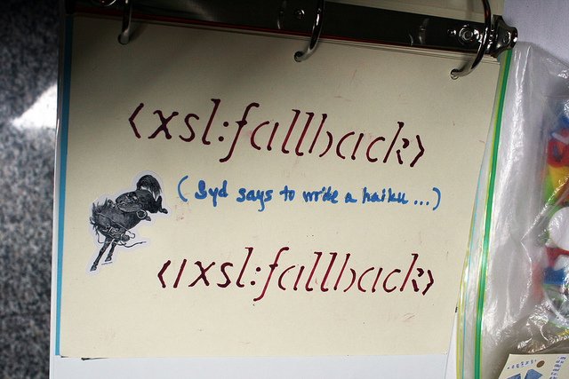

!SLIDE
# JRuby

!SLIDE

!SLIDE smallish

## INVOKEVIRTUAL

    INVOKEVIRTUAL example.getCallSite1 ...
    ALOAD 1
    ALOAD 2
    ALOAD 9
    INVOKEVIRTUAL org/jruby/runtime/CallSite.call ...

## INVOKEDYNAMIC

    ALOAD 1
    ALOAD 2
    ALOAD 9
    INVOKEDYNAMIC call ...

!SLIDE smallish

## INVOKEVIRTUAL

    INVOKEVIRTUAL org/jruby/runtime/CallSite.call(
        Lorg/jruby/runtime/ThreadContext;
        Lorg/jruby/runtime/builtin/IRubyObject;
        Lorg/jruby/runtime/builtin/IRubyObject;
      )Lorg/jruby/runtime/builtin/IRubyObject;

.notes context, caller, self

## INVOKEDYNAMIC

    INVOKEDYNAMIC call(
        Lorg/jruby/runtime/ThreadContext;
        Lorg/jruby/runtime/builtin/IRubyObject;
        Lorg/jruby/runtime/builtin/IRubyObject;
        Ljava/lang/String;
      )Lorg/jruby/runtime/builtin/IRubyObject;
      [...]

.notes context, caller, self, method name

!SLIDE smallish

# The Linker

      [org/jruby/runtime/invokedynamic/InvocationLinker
        .invocationBootstrap(
          Ljava/lang/invoke/MethodHandles$Lookup;
          Ljava/lang/String;
          Ljava/lang/invoke/MethodType;
        )Ljava/lang/invoke/CallSite;]

!SLIDE

!SLIDE small

# The Bootstrap

    @@@ java
    public static CallSite
    invocationBootstrap(Lookup lookup, String name, MethodType type)
    throws NoSuchMethodException, IllegalAccessException {
      CallSite site;
      // ...
      if (name.equals("call")) {
          site = new JRubyCallSite(lookup, type, CallType.NORMAL, false, false, true);
      }
      // ...
      MethodHandle myFallback = ...
      site.setTarget(myFallback);
      return site;
    }

!SLIDE

!SLIDE small

# The Fallback

    @@@ java
    public static IRubyObject invocationFallback(JRubyCallSite site, 
        ThreadContext context,
        IRubyObject caller,
        IRubyObject self,
        String name) throws Throwable {
      RubyClass selfClass = pollAndGetClass(context, self);
      CacheEntry entry = selfClass.searchWithCache(name);
      
      if (methodMissing(entry, site.callType(), name, caller)) {
        return callMethodMissing(entry, site.callType(), context, self, name);
      }
      
      MethodHandle target = getTarget(site, selfClass, name, entry, 0);
      target = updateInvocationTarget(target, site, selfClass, name, entry, false, 0);

      return (IRubyObject)target.invokeWithArguments(context, caller, self, name);
    }