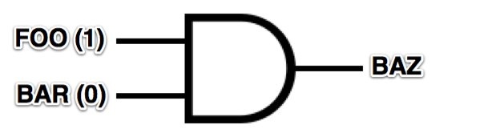

!SLIDE
## Last But Not Least

!SLIDE
# Hardware Programming

!SLIDE bullets

# VHDL

* <u>**V**</u>ery-high-speed integrated circuits <u>**H**</u>ardware <u>**D**</u>escription <u>**L**</u>anguage

!SLIDE bullets incremental

* everything is happening at the same time
* **everything** is happening **at the same time**

!SLIDE

<pre>
  architecture <b>RTL</b> of <b>FOOBAR</b> is
    <b>FOO</b> &lt;= <b>'1'</b>;
    <b>BAR</b> &lt;= <b>'0'</b>;
    <b>BAZ</b> &lt;= <b>FOO</b> and <b>BAR</b>;
  end architecture <b>RTL</b>;

</pre>

!SLIDE

# github.com/a-team/Pong