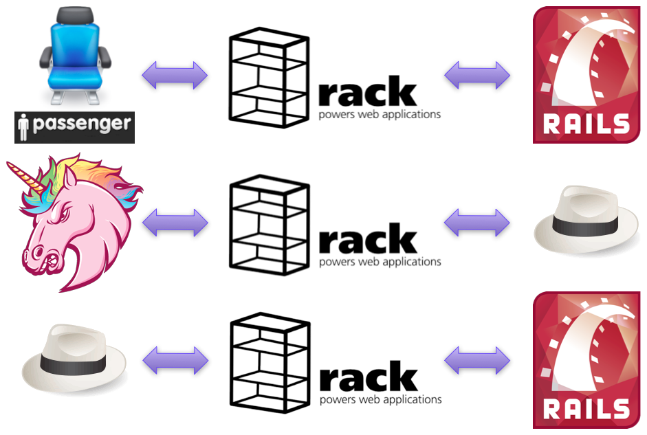
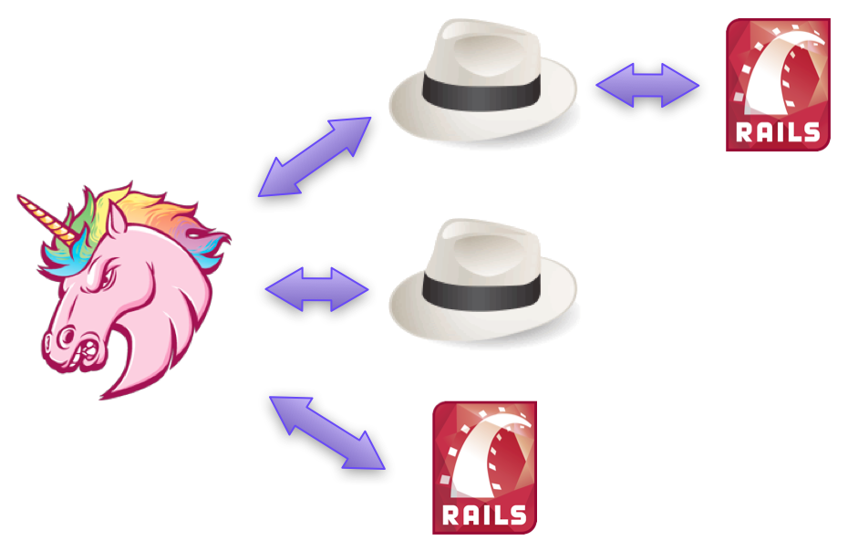
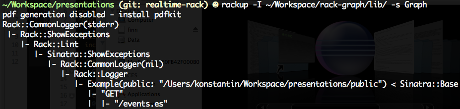
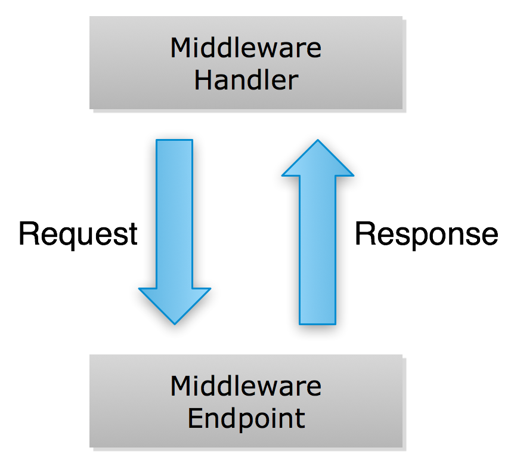

!SLIDE bullets

* After this talk, you'll be like...

!SLIDE center

!SLIDE bullets

* Breaking the laws of <s>physics</s> Rack!

!SLIDE bullets incremental

* polling sucks
* even long polling

!SLIDE bullets

* decide what to send while streaming, not upfront

!SLIDE bullets

* Streaming APIs
* Server-Sent Events
* Websockets

!SLIDE center

# Demo! #

<iframe src="/events?" width="980" height="600"></iframe>

!SLIDE center

!SLIDE center

!SLIDE center

!SLIDE

    @@@ ruby
    welcome_app = proc do |env|
      [200, {'Content-Type' => 'text/html'},
        ['Welcome!']]
    end

!SLIDE

    @@@ ruby
    get('/') { 'Welcome!' }

!SLIDE

    @@@ ruby
    # 
foo
 => 
FOO

    class UpperCase
      def initialize(app)
        @app = app
      end

      def call(env)
        status, headers, body = @app.call(env)
        upper = []
        body.each { |s| upper << s.upcase }
        [status, headers, upper]
      end
    end

!SLIDE large

    @@@ ruby
    # set up middleware
    use UpperCase

    # set endpoint
    run welcome_app

!SLIDE

    @@@ ruby
    env            = parse_http
    uppercased_app = UpperCase.new welcome_app
    result         = uppercased_app.call env

    generate_http(result)

!SLIDE center

!SLIDE
# Streaming with #each #

!SLIDE

    @@@ ruby
    my_body = Object.new
    get('/') { my_body }

    def my_body.each
      20.times do
        yield "
%s
" % Time.now
        sleep 1
      end
    end

!SLIDE bullet

* Let's build a messaging service!

!SLIDE

    @@@ ruby
    subscribers = []

    get '/' do
      body = Subscriber.new
      subscribers << body
      body
    end

    post '/' do
      subscribers.each do |s|
        s << params[:message]
      end
    end

!SLIDE

    @@@ ruby
    class Subscriber
      def <<(line)
        @line = line
        @thread.wakeup
      end

      def each
        @thread = Thread.current
        loop do
          yield @line.to_s
          sleep
        end
      end
    end

!SLIDE bullets incremental

* blocks the current thread
* does not work well with some middleware
* does not work on evented servers (Thin, Goliath, Ebb, Rainbows!)

!SLIDE

# Evented streaming with async.callback #

!SLIDE center

!SLIDE center

!SLIDE

# With #throw #

    @@@ ruby
    get '/' do
      EM.add_timer(10) do
        env['async.callback'].call [200,
          {'Content-Type' => 'text/html'},
          ['sorry you had to wait']]
      end

      # will skip right to the handler
      throw :async
    end

!SLIDE

# Status Code -1 #

    @@@ ruby
    get '/' do
      EM.add_timer(10) do
        env['async.callback'].call [200,
          {'Content-Type' => 'text/html'},
          ['sorry you had to wait']]
      end

      # will go through middleware
      [-1, {}, []]
    end

!SLIDE

    @@@ ruby
    require 'sinatra/async'

    aget '/' do
      EM.add_timer(10) do
        body 'sorry you had to wait'
      end
    end

!SLIDE

    @@@ ruby
    env = parse_http
    cb  = proc { |r| generate_http(r) }

    catch(:async) do
      env['async.callback'] = cb
      response = app.call(env)
      cb.call response unless response[0] == -1
    end

!SLIDE bullets incremental

* that's postponing ...
* ... not streaming

!SLIDE bullets

* EM::Deferrable

!SLIDE

    @@@ ruby
    subscribers = []

    get '/' do
      body = Subscriber.new
      subscribers << body
      body
    end

    post '/' do
      subscribers.each do |s|
        s << params[:message]
      end
    end

!SLIDE

    @@@ ruby
    subscribers = []

    aget '/' do
      body Subscriber.new
      subscribers << body
    end

    post '/' do
      subscribers.each do |s|
        s << params[:message]
      end
    end

!SLIDE

    @@@ ruby
    class Subscriber
      include EventMachine::Deferrable

      def <<(line)
        @body_callback.call(chunk)
      end

      def each(&blk)
        @body_callback = blk
      end
    end

!SLIDE

    @@@ ruby
    delete '/' do
      subscribers.each do |s|
        s << "Bye bye!"
        s.succeed
      end
    end

!SLIDE bullets

# Server-Sent Events #

* [dev.w3.org/html5/eventsource](http://dev.w3.org/html5/eventsource/)

!SLIDE

    @@@ javascript
    var source = new EventSource('/updates');
    
    source.onmessage = function (event) {
      alert(event.data);
    };

!SLIDE bullets incremental

* Think one-way WebSockets
* No protocol upgrade
* Resumable
* Client can be implemented in JS
* Degrade gracefully to polling

!SLIDE

    @@@ ruby
    class EventSource
      include EventMachine::Deferrable

      def send(data, id = nil)
        data.each_line do |line|
          line = "data: #{line.strip}\n"
          @body_callback.call line
        end
        @body_callback.call "id: #{id}\n" if id
        @body_callback.call "\n"
      end

      def each(&blk)
        @body_callback = blk
      end
    end

!SLIDE bullets

# WebSockets #

* Think two-way EventSource

!SLIDE bullets incremental

# WebSockets have issues #

* Clients need patching
* Servers need patching
* Proxies need patching
* Rack needs patching
* Security issues

!SLIDE

    @@@ javascript
    var src = new WebSocket('ws://127.0.0.1/');
    
    src.onmessage = function (event) {
      alert(event.data);
    };

!SLIDE

    @@@ javascript
    var src = new EventSource('/updates');

    src.onmessage = function (event) {
      alert(event.data);
    };

!SLIDE

    @@@ ruby
    options = { host: '127.0.0.1', port: 8080 }
    EM::WebSocket.start(options) do |ws|
      ws.onmessage { |msg| ws.send msg }
    end

!SLIDE bullets incremental

# SPDY #

* Replacement for HTTPS
* Supports pushing
* No Ruby implementation
